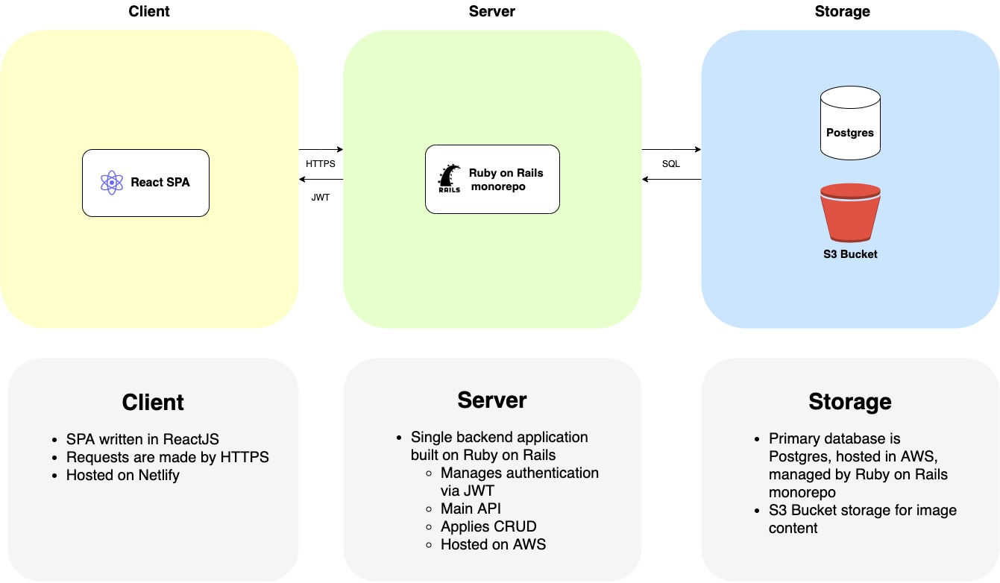
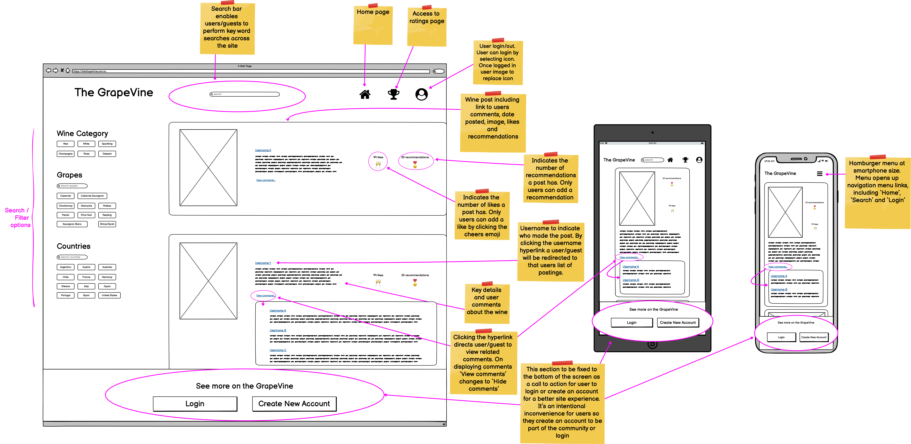
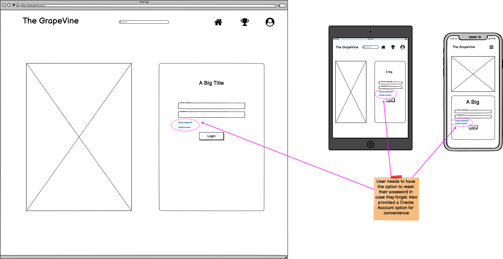
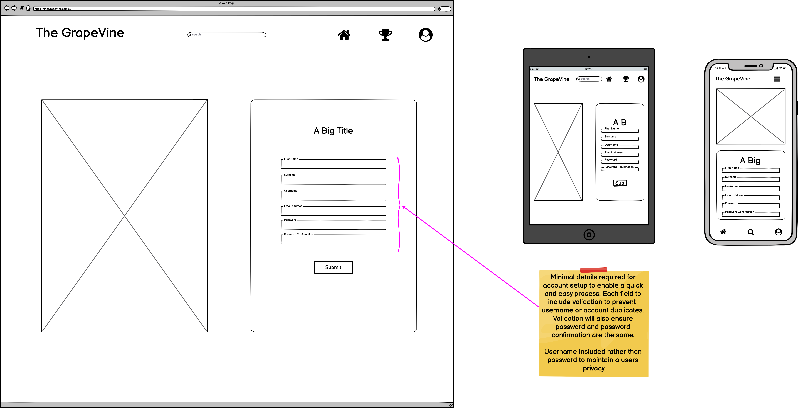
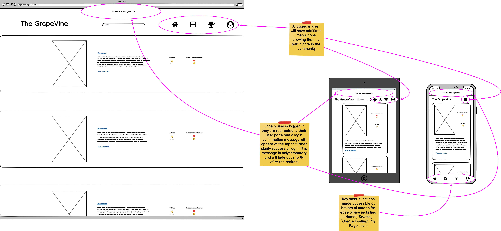
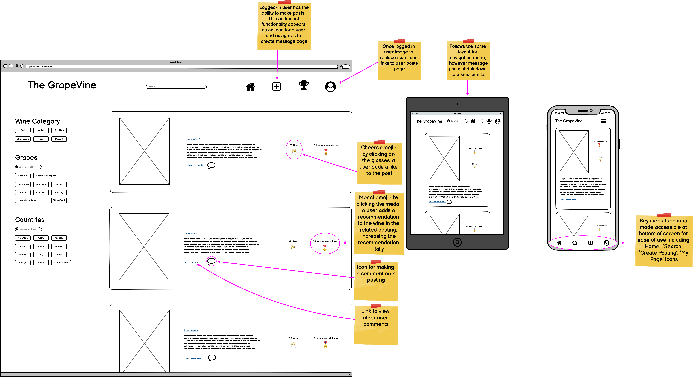
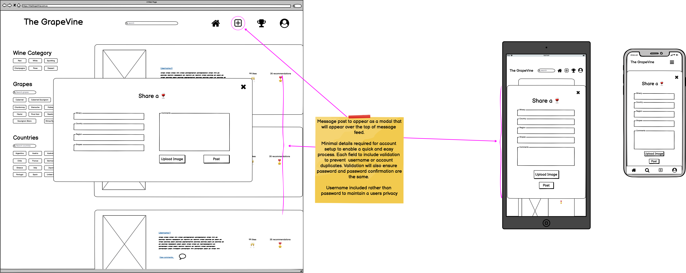

# The GrapeVine

### T3A2-A, Full Stack App (Part A)

#### A Team Project By: Jacqueline Cope & Nga Dang

---

### Purpose

Following a few glasses of wine and plenty of conversation with our client, _Vineyard Productions_, we have been requested to create a full stack web application to support wine lovers of Australia.

The purpose of the site is to bring people together on a dedicated platform where they can share their love of wine and learn a tip or two along the way. This benefits the community of wine consumers at all levels to then be able to try recommended wines by those who have shared and contributed within the community.

In addition to sharing wine experiences, a dashboard of the most popular wines that users have _liked_ or _recommended_ will be available.

### Functionality / Features

- Age verification to ensure users are of legal age
- To participate in the community users must create an account, however non-users (guests) will have viewing access only and limited access to features
- A registered and signed in user that is authenticated:
  - Can create post of a wine they enjoyed to share with the public
  - Has the ability to like a wine that has been posted, which will increase the popularity of the wine and may be displayed in the dashboard
  - Can comment on other users posts
  - Can delete or edit their own post
  - Cannot adjust or delete another persons comments
  - Has the ability to browse the catalogue of other contributors (other posts) and add comments accordingly
- A guest may access and read all comments and see ratings without contributing. Contributing means making comments or participating in rating the wines
- A Navbar to store all main links for easy navigation of the site, including login/sign-up
- The site runs on the basis of trust, where the user may _like_ a wine post by 'cheersing' (🥂) to like a post, following a similar concept to Facebook/Twitter. A user who has tried the wine and would like to recommend it to others can do so by _‘recommending’_ (🎖) the wine.
- The website will include filtering options to assist in the user search experience ie. wine type, grape, etc
- The site will include wine ratings to show the most popular wines rated by users
- The site will include 2 types of user accounts, including a website administrator as well as a standard user accounts. All users will login via the same login access
- A website administrator will have the ability to delete inappropriate content of any user

### Target Audience

- The target audience will need to be at the right legal age for drinking. The user must be 18+
- The App is targeted for users living in Australia at varying age groups

### Tech Stack

**Frontend:** React, HTML, CSS
**Backend:** Rails API
**Database:** PostgreSQL, AWS S3
**Deployment:** AWS, Netlify
**DevOps:** Git, GitHub, VSCode
**Testing:** RSpec - Rails, JEST - JavaScript
**Utilities:** Draw.io, Balsamiq Wireframes
**Project-management tools:** Trello, Discord

**React libraries:**

- JWT - user authentication/authorisation
- Styled Components
- React Bootstrap

### Application Architecture Diagram

### Wireframes

#### Generic Home Page

#### Login

#### Signup

#### Confirmed Login

#### Loggedin User Home Page

#### Create Posting

