# The GrapeVine 🍇

## A Rails & React App by Jacqueline Cope & Nga Dang

### T3A2, Full Stack App

---

### Key Links:

🌟 Deployed App: https://thegrapevine.netlify.app/

🖥 Client Repo: https://github.com/TheGrapeVineCo/client

🖥 Server Repo: https://github.com/TheGrapeVineCo/Server

📖 Documentation Repo: https://github.com/TheGrapeVineCo/The-GrapeVine-Docs

---

## Purpose

Following a few glasses of wine and plenty of conversation with our client, _Vineyard Productions_, we have been requested to create a full stack web application to support the wine lovers of Australia and Australian wine industry.

The purpose of the site is to bring people together on a dedicated platform where they can share their love of Australian wine and learn a tip or two along the way. This benefits the community of wine consumers at all levels to then be able to try recommended wines by those who have shared and contributed within the community.

In addition to sharing wine experiences, a dashboard of the most popular wines that users have _liked_ or _recommended_ will be available.

To help read this document and understand some terms used, we have supplied a glossary page at the very end of this README.md

## Functionality / Features

- Age verification to ensure users are of legal age
- Each week the website administrator will share a number of new wines, as wine listing, for users to share their opinions about
- To participate in the community users must create an account, however non-users (guests) will have viewing access only and limited access to features
- A registered and logged in user that is authenticated:
  - Has the ability to like a wine listing, which will increase the popularity of the wine product and may be displayed in the dashboard
  - Can comment on a wine listing
  - Can delete or edit their own comments
  - Cannot adjust or delete another person's comments
- A guest may access and read all comments and see ratings without contributing. Contributing means making comments or participating in rating the wines
- A Navbar to store all main links for easy navigation of the site, including login/sign-up
- The user may _like_ a wine listing by 'cheersing' (🥂) to like a wine listing, following a similar concept to Facebook/Twitter.
- On the basis of trust, a user who has tried the wine and would like to recommend it to others can do so by _‘recommending’_ (🎖) the wine.
- The website will include filtering options to assist in the user search experience ie. wine type, grape, etc
- The site will include wine ratings to show the most popular wines rated by users
- The site will include 2 types of user accounts, including a website administrator as well as a standard user accounts. All users will login via the same login access
- A website administrator will have the ability to delete inappropriate content of any user

---

### Client Review

After a follow up meeting with out client, it was agreed that a number of features that were original agreed upon in the MVP would be reduced. This has come about due to lack of investment in time and funding. As the app is highly scalable it was also agreed that the basics of having a social media site be established and further features can build upon in future releases. The changes to the MVP now aim to include the following:

- Ability for the website administrator to share new wines, as wine listing, for users to share their opinions about
- Account signup functionality whereby users can create an account to have further access to participate in the community
- Non-users (guests) to have viewing access only and limited access to features
- A registered and logged in user that is authenticated:
  - Can comment on a wine listing
  - Can delete or edit their own comments
  - Cannot adjust or delete another person's comments
- A guest may access and read all comments and see ratings without contributing. Contributing means making comments or participating in rating the wines
- A Navbar to store all main links for easy navigation of the site, including login/sign-up
- The site will include 2 types of user accounts, including a website administrator as well as a standard user accounts. All users will login via the same login access
- A website administrator will have the ability to delete inappropriate content of any user

---

### Target Audience

- The target audience will need to be at the right legal age for drinking. The user must be 18+
- The App is targeted for users living in Australia at varying legal age groups specifically interested in Australian wines

---

### Tech Stack

**Frontend:** React, HTML, CSS

**Backend:** Rails API

**Database:** PostgreSQL

**Deployment:** Front-end: Netlify & Back-end: Heroku

**DevOps:** Git, GitHub, VSCode

**Testing:** RSpec, client.http - Rails, JEST - JavaScript

**Utilities:** Draw.io, Balsamiq Wireframes

**Project-management tools:** Trello, Discord

## Server Gems & Dependencies

- **Rails ~>6.1.6** - Rails is a server-side fullstack application framework. It provides an out of the box structure for both the front and back end of a web application. For the purpose of this project, it has been used to facilitate the backend of the application.
- **Pg ~>1.1** - This is the Postgresql gem that is used for the database for the application. All data is maintained in postgres and data obtained through requests.
- **Puma ~>5.0** - Puma is a fast and easy to use HTTP server that is used by Rails. It is the default server for Rails to pass data to its delegated client.
- **Bootsnap >=1.4.4** - This is a library that is automatically installed with Rails. It is used to optimise and cache expensive computations.
- **Devise** - Provides complete MVC authentication for Rails applications. It provides a reliable, easy to implement and safe solution for authentication that is widely used across the Rails community.
- **Devise-jwt** - This gem expands from Devise, using JWT Tokens for user authentication. It assists in allowing users to signup, login and logout safely from the application.
- **Faker** - The Faker library provides a wide range of test data that can be used to populate a database. To reduce time spent writing out seed files, this gem has been used to populate users as well as comments.
- **Listen** - Listen is an out of the box gem that tracks and notifies whoever is subscribed of file modifications.
- **Spring** - The Spring preloader gem allows the application to be running in the background simultaneously as tje user makes changes to files. This is another out of the box gem that comes when installing Rails.
- **tzinfo-data** - This gem provides access to a time zone database which allows times to be converted using the rules that are in the gem.

## Client Libraries & Dependencies

- **Autoprefixer ^10.4.5** - Autoprefixer assists in parsing CSS files by adding vendor prefixes to CSS rules.
- **Axios ^0.27.2** - Axios is a JavaScript library that facilitates HTTP requests to the server from the client. It has been implemented to provide a connection to the server in a safe and efficient manner.
- **Bootstrap ^5.1.3** - Bootstrap is a collection of HTML, CSS abd JavaScript tools that is used to build sleek and intuitive user interfaces. Elements can be easily styled with the out of the box designs that allow a responsive web app environment.
- **Node-sass ^7.0.1** - This library binds Node.js to Sass, allowing us to compile SCSS files to CSS.
- **React ^18.2.0** - A JavaScript library for building UI components. This is known as the view layer and maintains what users see and interact with.
- **React-bootstrap ^2.4.0** - Built specifically for React, Bootstrap is a component-based library that provides Bootstrap components as React components. This in turn provide a more intuitive and friendly UX. The decision to implement React Bootstrap as opposed to other libraries was due to the fact that it is an extremely popular styling library and also felt it was important to expand on the skills in using it. While Material UI (MUI) was considered as another option, React Bootstrap seemed to be clear and provided a vast array of supportive material in addition to it being a personal goal to hone.
- **React-dom ^18.2.0** - The ReactDOM library provides special methods that bind react to the DOM. This provides the ability to render react elements to the DOM.
- **React-router-dom ^6.3.0** - Provides dynamic web application routing that contains DOM bindings on a SPA.
- **React-scripts ^5.0.1** - Provided when installing `create-react-app` this dependency assists in setting up the development environment and starts a server and provides hot reloading functionality.
- **Jest** - Although `Create-React-App` does include Jest out of the box, the app has been installed due to testing issues related to React Bootstrap. Jest is a testing framework built on Javascript that provides a testing framework for React applications.

### Data Flow Diagrams

### Application Architecture Diagram

### User Stories

There are numerous possibilities to scale up the site. Therefore, the minimum viable product has been outlined with additional features to be added should time permit in the first release.

#### Minimum Viable Product

| As a...                           | I want to...                                                                                     | so that...                                                                                           |
| --------------------------------- | ------------------------------------------------------------------------------------------------ | ---------------------------------------------------------------------------------------------------- |
| user / guest                      | view all wines listings, including the comments and the number of likes and recommendations      | I am able to see what recommendations others have and how others have responded to a particular wine |
| guest                             | create an account with an email address, username and password                                   | I have a unique account that is secure and doesn’t require providing too much personal information   |
| user                              | comment on a wine that has been listed                                                           | I can share my opinion/experience with the community                                                 |
| user                              | be able to like a wine listing                                                                   | I can share my opinion with the community                                                            |
| user                              | be able to recommend a wine if I have tried it                                                   | others can know about this wine, boosting its popularity                                             |
| user                              | sign out when I have finished using the site                                                     | I can close my session off and my account is secured                                                 |
| user / guest / site administrator | be able to navigate the site easily without having to guess where to find certain site functions | I can navigate easily                                                                                |
| guest                             | be able to see what the community is about and has to offer                                      | I can understand if it’s relevant to my interests                                                    |
| user / guest                      | know what wines are popular                                                                      | I can try something new                                                                              |
| user                              | be able to edit or delete my own comment                                                         | if I make a mistake or need to retract a comment I am able to                                        |
| site administrator                | add a new wine to the wine list in a convenient and easy manner                                  | the process is quick and easy to follow                                                              |
| site administrator                | be able to edit or delete a wine listing                                                         | I am able to make modifications to all wine products from the wine listings                          |

#### Additional Features

| As a...            | I want to...                                                                        | so that...                                                                            |
| ------------------ | ----------------------------------------------------------------------------------- | ------------------------------------------------------------------------------------- |
| user / guest       | search flavour profiles that I like                                                 | I can discover wines that match the flavour profiles I prefer                         |
| user / guest       | have the ability to search wine products, whether that is by name, grape type, etc. | I can discover new wines that are relevant to what I’m searching                      |
| user               | be able to save the wines that I've tried or liked                                  | I can remember and try them                                                           |
| user               | be able to report a post or comment I deem as inappropriate                         | I am comfortable within the community and that the terms of site use are being upheld |
| site administrator | be able to remove anything reported as offensive                                    | it is able to be reviewed if meets the terms of site use                              |
| user / guest       | be able to get in contact with the site owner                                       | if I have any problems or suggestions I can pass it on to someone who can assist      |

### Wireframes

#### Standard Home Page

#### Login

#### Signup

#### Loggedin User Home Page

#### Wish List

#### Search Output

#### Report A Users Comment

#### Contact Us

#### Wine Ratings

#### Administrator Dashboard

#### Create Post

#### Update A Post

#### Delete Post

#### Administrator Notification

---

### Source Control Workflow

This project has implemented the feature branch workflow across our GitHub organisation [The GrapeVineCo](https://github.com/TheGrapeVineCo) to better support version control, including the client, server and documentation repositories.

Each repository started with one `main` branch with features gradually added in. This was done by creating new branches for each feature, building each feature with regular commits. Then pushing to main and making a pull request when the feature is ready or significant changes have included that should be integrated to main. With this approach we were able to maintain an agile approach that provided more discussion over code and to be able to review if the other person needed support.

In order to protect our main branch and to foster a collaborative approach to the code base, additional security features were added so that when pushing to GitHub we maintained that 1.) the individual couldn't accidentally push to the `main` branch; and 2.) to ensure that all pull requests are reviewed and approved before merging to main, including ones made after the pull request was approved. This arrangement has supported a more collaborative workflow and also prevented small and costly mistakes being made to the code base.

### Trello Board

#### Trello board explanation and workflow

In our kick-off meeting, we chose to use the Trello board to help us manage our project. With Trello, we are able to use the Kanban method to help us work in an agile workflow. Allowing for easy changes to be integrated into our workflow. These changes may come from our developer team or directly from out client.

You will see in the screenshots below that we work off from the five typical columns: Backlog, To do, Doing, Testing & Done.

Starting from the left of the board, we will have activities that require action and upon agreement and prior discussion, we would then have team members allocated to each cards.
Upon completion of each card, the second team member would review the work to ensure we have quality checking.

We have come across some cards require to be brought back from the ‘done’ section, as it requires further modification after a review. This usually calls for a team meeting and sometimes original ideas will require rethinking and changes need to be made.

You can see this happened in the screenshots below for the User Stories and Architecture Diagram cards.

Each task/cards will have a ‘due date’ nominated to ensure we have some idea of priority in our work time frame of when they should be completed. Anything that is overdue will change its colour from green to red to alert us.

As a member of the Trello, I can see where and what my team member have changed on the cards as it displays a red bell notification on my version of trello. You can see this below on Trello dated 03_07_22.

You may also go to this link to view the Trello board live

[The GrapeVine Trello Board](https://trello.com/b/RRluofOJ)

## Trello screenshots

The following screenshots take a snapshot at the end of each week. Additional screenshots documenting the workflow progress can be found in [this](https://github.com/TheGrapeVineCo/The-GrapeVine-Docs/tree/main/docs/trello) folder.

### Initial phase of the project

Project commenced:

<!-- Below, you can see Jacqui's Trello Board for the day. -->

<!-- 

Below, you can see that on the same day, Nga have the red bell notification alerting her of the changes her team member had made. -->

<!-- 

 -->

Week 1:

<!-- 

Below, you can see that we had to move the 'User stories' card back from the 'Done' column as it needed to be changed to suit the new scope.

Below, you can see the detailed log of the card 'User stories', capturing the new scope and what new work is required to cover the new scope.

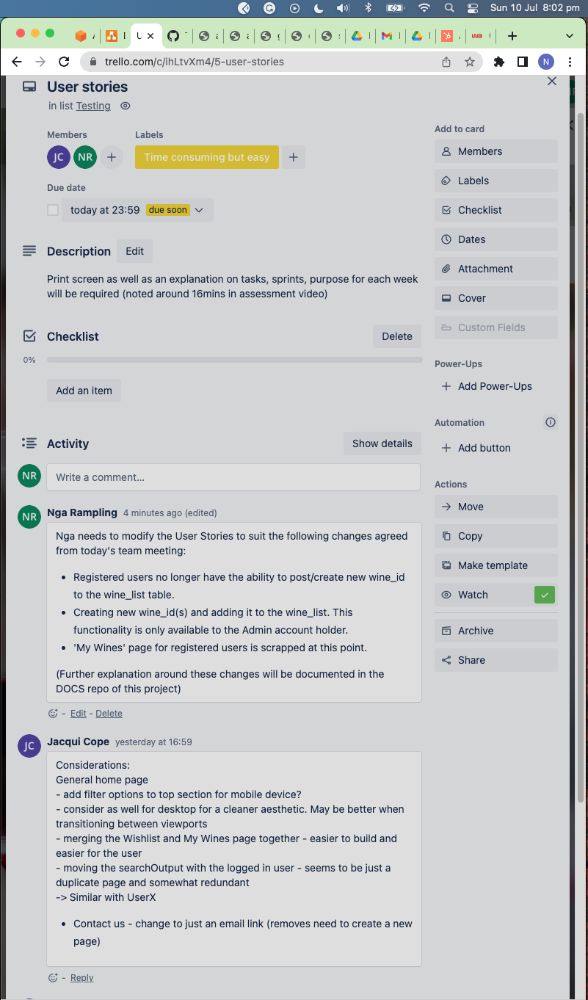

Below shows the architecture diagram, also needed a review and changes required.

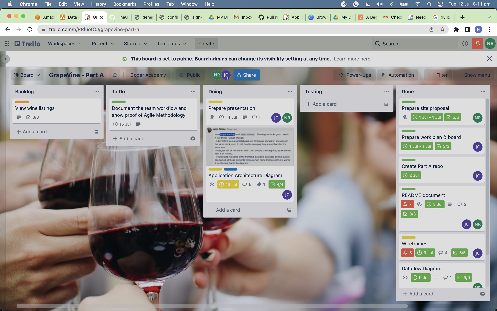

Below shows the detailed log of the card 'Application Architecture Diagram', capturing the changes and other issues encountered.

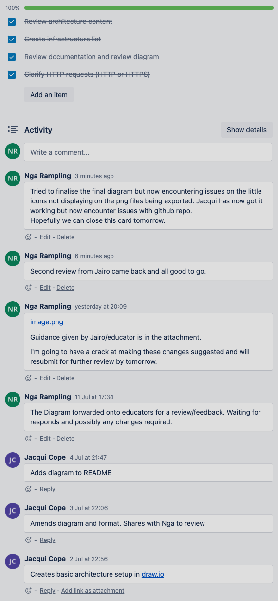 -->

Week 2:
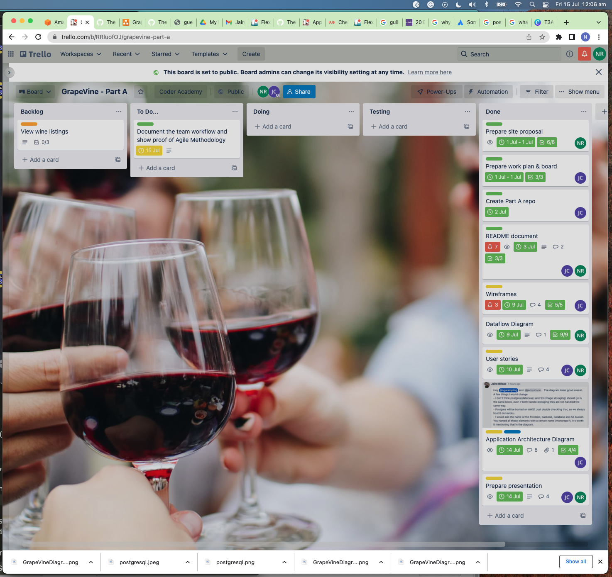

### Second phase of the project

Week 3:

Week 4:

Week 5:

## User Testing in Development Enviroment

As developers, it is efficient to test the working of our application in a Development enviroment before testing on Production Enviroment.

Various tools were used in this project to help with the testing.

1. The images below shows that we used the web developer tool, straight from the Chrome browser for testing development enviroment during integrations of front end and back end.

Here, we were testing if Axios has successfully been used to send a **POST request** to the back end Rails API to store data into local postgreSQL database. The object found in the Payload helps to confirm what data is being passed through. It was important to Rails Devise that the data needed to be in a certain request format to meet the requirement for registering the users in the backend. This was simply encapsulating the object inside **user**, and we can see that this has happened in the Payload.

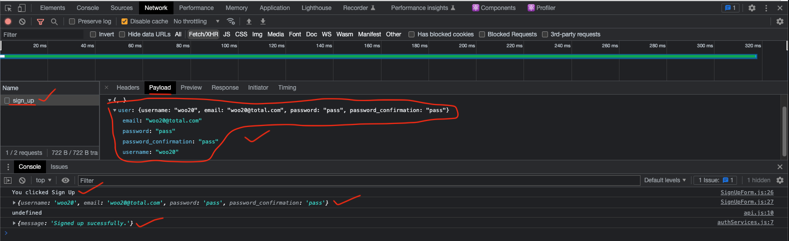

Then, in additional to this, we queried the local postgreSQL using our terminal and was able to check that we have successfully inserted the same user in the table.

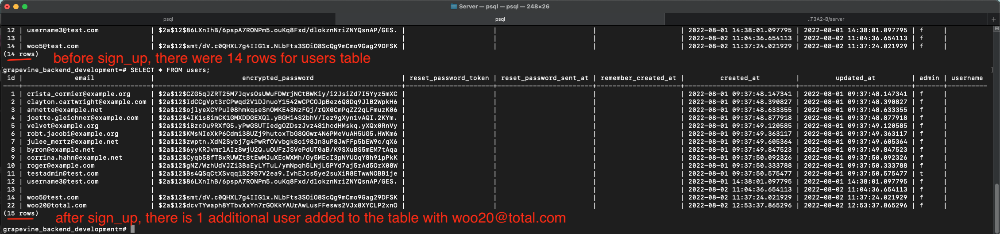

2. Using web developer tools, we checked if sessionStorage had worked and stored the data in the browser. In this case, we have the keys but value is 'undefined'.

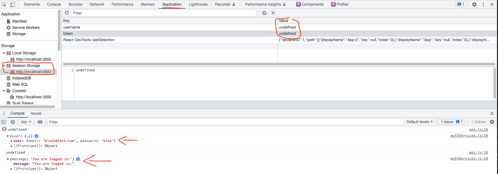

After making adjustments to the codes, we checked the web developer tool again and it showed us that the **username** and **token** keys now have correct values and have persisted in the sessionStorage.

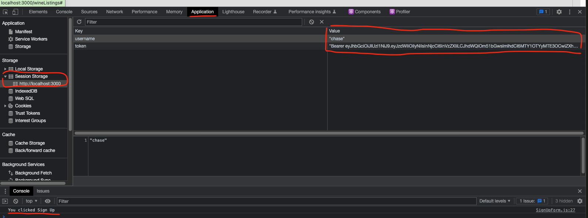

3. Here we are testing for successfully storing new registered user from the browser to Heroku PostgreSQL database.
In the Chrome dev tool, we can see that this passes ok.

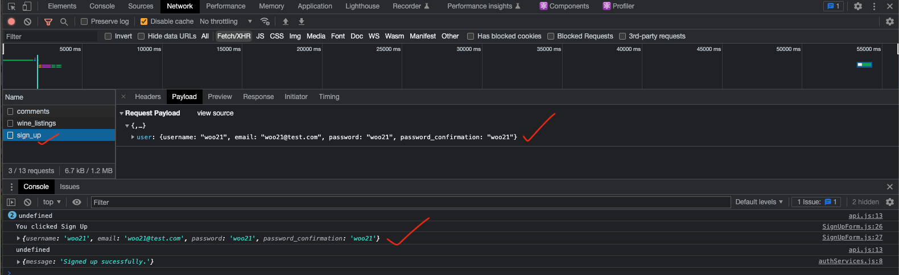

Then we can check if same user from the sign up has been inserted into Heroku PostgreSQL database and not our local. This was done using the Heroku Command Line Interface directly from the terminal. The Heroku CLI is very useful that we can directly see updates conveniently from the terminal, after logging in remotely from the terminal.

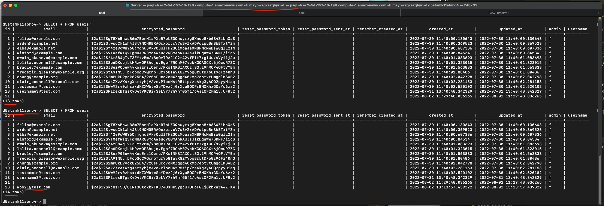

Heroku has been set up to automatically deploy from our `main` branch, Server repo, in Github. Each time we `merge` our `feature` branch into the `main` during development phase, Heroku runs a new build and automatically deploys. It even logs the corresponding git commit id number to help with any backtracing.

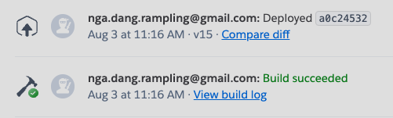

### Glossary Page

Each terminology descriptions are not fixed. We can overwrite them over team agreements. The purpose of this document is to help us be consistent with the terminology we use, enhancing communications and collaborations skills.

**Comment** - A comment is a block of the text created by registered users and is appended to a wine listing of their choice.

**Wine listing** - A wine listing is an individual wine product with its own title, description and image. It has a provision to have comments placed against it by registered users. A wine listing is one extraction from the wine listings.

**Wine listings** - Wine listings is the collection or library of all the wine listing.

**Like** - Is an action, for when a user wants to increment the ranking for ‘liking a wine listing’. We are using the emoji 🥂 to represent this.

**Recommendation** - Like is an action, for when you want to increment the ranking for ‘liking a wine listing’. We are using the emoji 🎖 to represent this.

**Sign up** - When a guest wants to create an account with the app and becomes a registered user.

**Log in** - For when a user with an account has successfully entered their user details and the response is happy and verified.

**Log out** - For when a user wants to exit/close off the ‘logged in’ state and the browser is back to guess mode.

**Guest** - A term used for a user who is currently not logged in with a valid account.

**User** - A term used for a user who has an account and is also currently logged in.

**Admin** - A user who has an accelerated account with more abilities than a registered user.

_Post_ - Please note that this term is currently not being used. An example of when this can be used: a post is when a registered user creates a new wine listing. This function isn’t available in this first version of the app.
