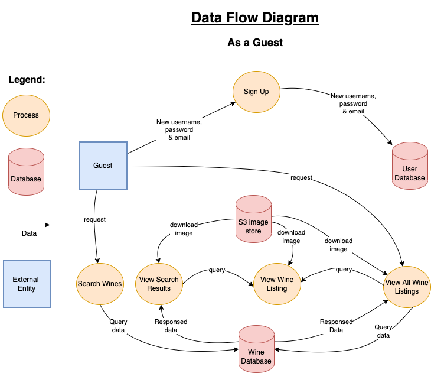

# The GrapeVine

### T3A2-A, Full Stack App (Part A)

#### A Team Project By: Jacqueline Cope & Nga Dang

---

### Purpose

Following a few glasses of wine and plenty of conversation with our client, _Vineyard Productions_, we have been requested to create a full stack web application to support the wine lovers of Australia and Australian wine industry.

The purpose of the site is to bring people together on a dedicated platform where they can share their love of Australian wine and learn a tip or two along the way. This benefits the community of wine consumers at all levels to then be able to try recommended wines by those who have shared and contributed within the community.

In addition to sharing wine experiences, a dashboard of the most popular wines that users have _liked_ or _recommended_ will be available.

### Functionality / Features

- Age verification to ensure users are of legal age
- Each week the website administrator will share a number of new wines, as posts, for users to share their opinions about
- To participate in the community users must create an account, however non-users (guests) will have viewing access only and limited access to features
- A registered and signed in user that is authenticated:
  - Has the ability to like a wine that has been posted, which will increase the popularity of the wine and may be displayed in the dashboard
  - Can comment on wine posts
  - Can delete or edit their own post
  - Cannot adjust or delete another person's comments
  - Has the ability to browse the catalogue of other contributors (other posts) and add comments accordingly
- A guest may access and read all comments and see ratings without contributing. Contributing means making comments or participating in rating the wines
- A Navbar to store all main links for easy navigation of the site, including login/sign-up
- The site runs on the basis of trust, where the user may _like_ a wine post by 'cheersing' (🥂) to like a post, following a similar concept to Facebook/Twitter. A user who has tried the wine and would like to recommend it to others can do so by _‘recommending’_ (🎖) the wine.
- The website will include filtering options to assist in the user search experience ie. wine type, grape, etc
- The site will include wine ratings to show the most popular wines rated by users
- The site will include 2 types of user accounts, including a website administrator as well as a standard user accounts. All users will login via the same login access
- A website administrator will have the ability to delete inappropriate content of any user

### Target Audience

- The target audience will need to be at the right legal age for drinking. The user must be 18+
- The App is targeted for users living in Australia at varying legal age groups specifically interested in Australian wines

### Tech Stack

**Frontend:** React, HTML, CSS

**Backend:** Rails API

**Database:** PostgreSQL, AWS S3

**Deployment:** Netlify & Heroku

**DevOps:** Git, GitHub, VSCode

**Testing:** RSpec - Rails, JEST - JavaScrupt

**Utilities:** Draw.io, Balsamiq Wireframes

**Project-management tools:** Trello, Discord

**React libraries:**

- JWT - user authentication/authorisation
- Styled Components
- React Bootstrap

### Data Flow Diagrams

### Application Architecture Diagram

### User Stories

There are numerous possibilities to scale up the site. Therefore, the minimum viable product has been outlined with additional features to be added should time permit in the first release.

#### Minimum Viable Product

| As a...                           | I want to...                                                                                     | So that...                                                                                           |
| --------------------------------- | ------------------------------------------------------------------------------------------------ | ---------------------------------------------------------------------------------------------------- |
| user / guest                      | view all wines listed, including the comments and the number of likes                            | I am able to see what recommendations others have and how others have responded to a particular wine |
| guest                             | create an account with an email address, username and password                                   | I have a unique account that is secure and doesn’t require providing too much personal information   |
| user                              | comment on a wine that has been posted                                                           | I can share my opinion/experience with the community                                                 |
| user                              | be able to like a post                                                                           | I can share my opinion with the community                                                            |
| user                              | be able to recommend a wine if I have tried it                                                   | others can know about this wine, boosting its popularity                                             |
| user                              | sign out when I have finished using the site                                                     | I can close my session off and my account is secured                                                 |
| user                              | create a post in a convenient and easy manner                                                    | the process is quick, easy to follow and can be shared with the community                            |
| user / guest / site administrator | be able to navigate the site easily without having to guess where to find certain site functions | I can navigate easily                                                                                |
| guest                             | be able to see what the community is about and has to offer                                      | I can understand if it’s relevant to my interests                                                    |
| user / guest                      | know what wines are popular                                                                      | I can try something new                                                                              |
| user                              | be able to edit or delete my own post/comment                                                    | if I make a mistake or need to retract a comment I am able to                                        |
| site administrator                | add a new wine to the wine list in a convenient and easy manner                                  | the process is quic and easy to follow                                                               |
| site administrator                | be able to edit or delete wine(s) from the wine list                                             | I am able to make modifications if need be                                                           |

#### Additional Features

| As a...            | I want to...                                                                       | I want to...                                                                          |
| ------------------ | ---------------------------------------------------------------------------------- | ------------------------------------------------------------------------------------- |
| user / guest       | search flavour profiles that I like                                                | I can discover wines that match the flavour profiles I prefer                         |
| user / guest       | have the ability to search wines, whether that is by name, grape type, region etc. | I can discover new wines that are relevant to what I’m searching                      |
| User               | be able to save the wines that I've tried or liked                                 | I can remember and try them                                                           |
| user               | be able to report a post or comment I deem as inappropriate                        | I am comfortable within the community and that the terms of site use are being upheld |
| site administrator | be able to remove anything reported as offensive                                   | it is able to be reviewed if meets the terms of site use                              |
| user / guest       | be able to get in contact with the site owner                                      | if I have any problems or suggestions I can pass it on to someone who can assist      |

### Wireframes

#### Standard Home Page

#### Login

#### Signup

#### Loggedin User Home Page

#### Wish List

#### Search Output

#### Report A Users Comment

#### Contact Us

#### Wine Ratings

#### Administrator Dashboard

#### Create Post

#### Update A Post

#### Delete Post

#### Administrator Notification

### Trello Board

#### Trello board explanation and workflow

In our kick-off meeting, we chose to use the Trello board to help us manage our project. With Trello, we are able to use the Kanban method to help us work in an agile workflow. Allowing for easy changes to be integrated into our workflow. These changes may come from our developer team or directly from out client.

You will see in the screenshots below that we work off from the five typical columns: Backlog, To do, Doing, Testing & Done.

Starting from the left of the board, we will have activities that require action and upon agreement and prior discussion, we would then have team members allocated to each cards.
Upon completion of each card, the second team member would review the work to ensure we have quality checking.

We have come across some tasks that require to be brought back from the ‘done’ column as it requires further modification after a review. This usually calls for a team meeting and sometimes original ideas will require rethinking and changes need to be made.

You can see this happened in the screenshots below for the User Stories and Architecture Diagram cards.

Each task/cards will have a ‘due date’ nominated to ensure we have some idea of priority in our work timeframe of when they should be completed. Anything that is overdue will change its colour from green to red to alert us.

As a member of the Trello, I can see where and what my team member have changed on the cards as it displays a red bell notification on my version of trello. You can see this below on Trello dated 03_07_22.

#### Trello screenshots

Below, you can see Jacqui's Trello Board for the day.

Below, you can see that on the same day, I have the red bell notifcation alerting me of the changes my team member had made.

Below, you can see that we had to move the 'User stories' card back from the 'Done' column as it needed to be changed to suit the new scope.

Below, you can see the detailed log of the card 'User stories', capturing the new scope and what new work is required to cover the new scope.

Below shows the architecture diagram, also needed a review and changes required.

Below shows the detailed log of the card 'Application Architecture Diagram', capturing the changes and other issues encountered.

